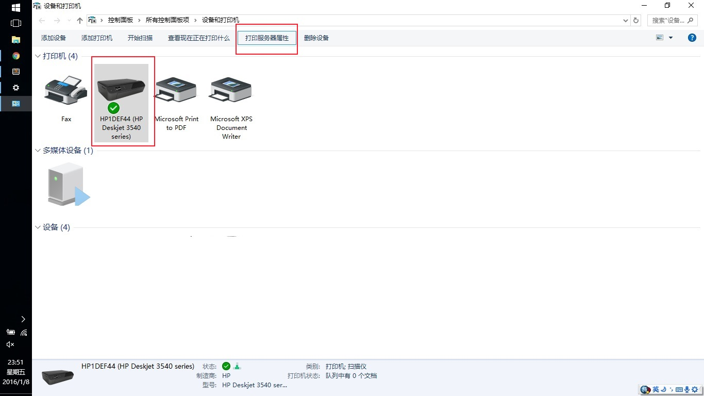
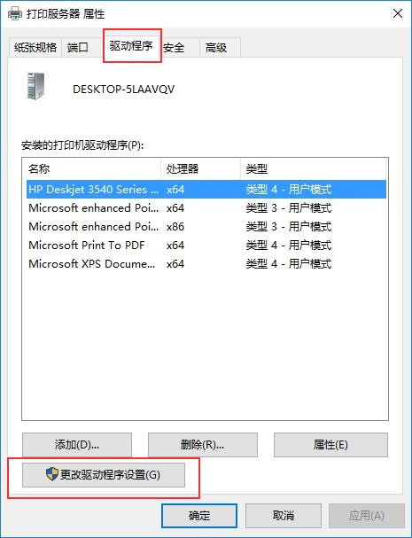
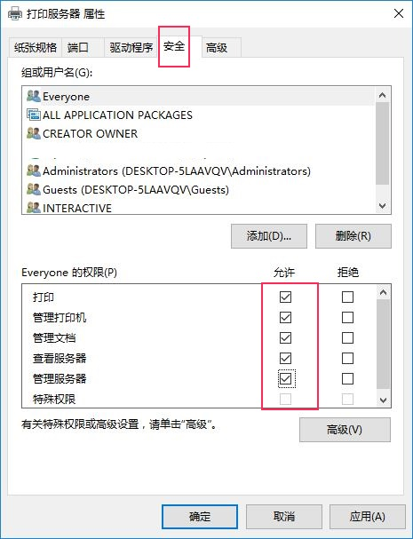

#windows 10 打印机的问题

Windows 10上打印有时会出现打印任务发送出去后，打印机没反应，任务栏打印机图标上显示：`0文档pending`, 检查`Print Spooling`服务也正常启动，可能的解决方法如下：

1. 进入`设置 - 设备 - 相关设置 - 设备和打印机`, 选中您的打印机，点击上面的`打印服务器属性`, 如图1：

2. `驱动程序标签` -> `更改驱动程序设置`，如图2：	

3. 切换到`安全`标签， 选中`Everyone`(或其他合适的用户), `允许`下面全勾选，如图3；	

现在试打印一下，看是否解决问题了。
